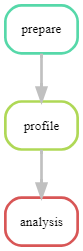

# Reproducing-Turkish-Music-Emotion

IS 477 final project. Ashwin Krishnan and Stefan Chu.

# Overview
The Turkish Music Emotion dataset created by Mehmet Bilal Er from Harran University looks to study music emotion recognition by using sentiment analysis tools to classify music emotions into four different classes: happy, sad, angry, and relax. The dataset uses a total of 400 music pieces from different genres of Turkish music, both verbal and nonverbal. Each class has an equal number of samples, 100 music pieces. The Turkish Music Emotion dataset can be obtained on the UCI Machine Learning Repository, https://archive.ics.uci.edu/dataset/862/turkish+music+emotion. It was donated on 14 August 2023

# Contributions
Stefan Chu: Worked on prepare_data.py and profile.py. Created the Snakefile for workflow to run all Python files. Created gitignore and requirements.txt files. Created the Workflow diagram and Dockerfile. Wrote the Overview, Reproducing, License, and References section.

Ashwin Krishnan: worked on the prepare_data.py, requirements.txt file, and analysis.py to create graph. Wrote the Analysis section in the README. Created the .zenodo.json file.

# Analysis
We created a graph that visualizes the relationship between the "_HarmonicChangeDetectionFunction_PeriodEntropy" (harmonics in audio signals) and "Class" variables. Essentially, it shows which values of harmonic detection lead to music being classified in the four different emotions of sounding "happy," "sad," "angry," and "relax(ed)." 

# Workflow

# Reproducing
Check requirements.txt to make sure you have all the required dependencies. If not, run pip install -r requirements.txt. Then download the dataset by running prepare_data.py with the command snakemake --core 1 prepare in the terminal. Next, extract the 'Acoustic Features.csv' from the turkish+music+emotion.zip file into the data folder. Next, to get the profile report, run the command snakemake --core 1 profile in the terminal. The resulting report.html can be found in the profiling folder. Finally, run snakemake --core 1 analysis to output plot.png in the results folder. We have come across an error where this sometimes runs profile.py and crashes. To fix this, move profile.py out of the scripts folder and run snakemake --core 1 analysis in the terminal again. The resulting plot.png will then show up in the results folder. 

# Software License

This project is under the MIT license. It is a permissive license that allow others to use the software for any purpose as long as they preserve the copyright and license notices that attribute the original work and its creator.

# Data License

This project is under the Creative Commons Attribution 4.0 International License. It allows others to share and adapt the dataset for any purpose as long as they credit its creator. 

# References
Bilal Er, M., & Aydilek, I. B. (2019). Music emotion recognition by using chroma spectrogram and deep visual features. Journal of Computational Intelligent Systems, 12(2), 1622–1634. International Journal of Computational Intelligence Systems, , DOI: https://doi.org/10.2991/ijcis.d.
